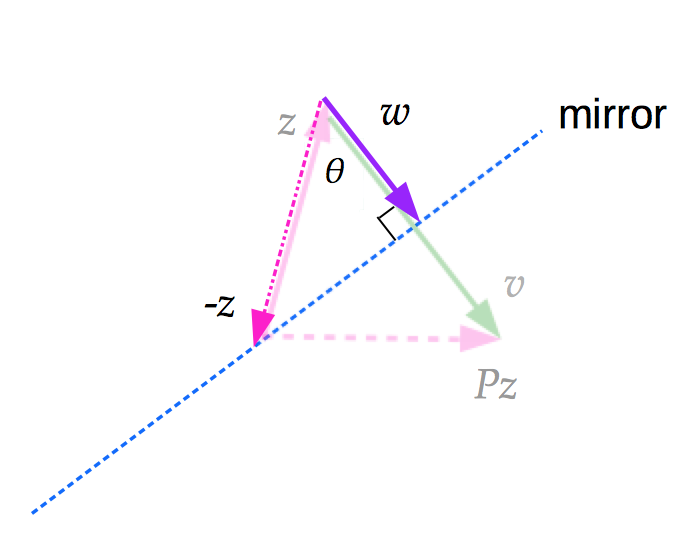
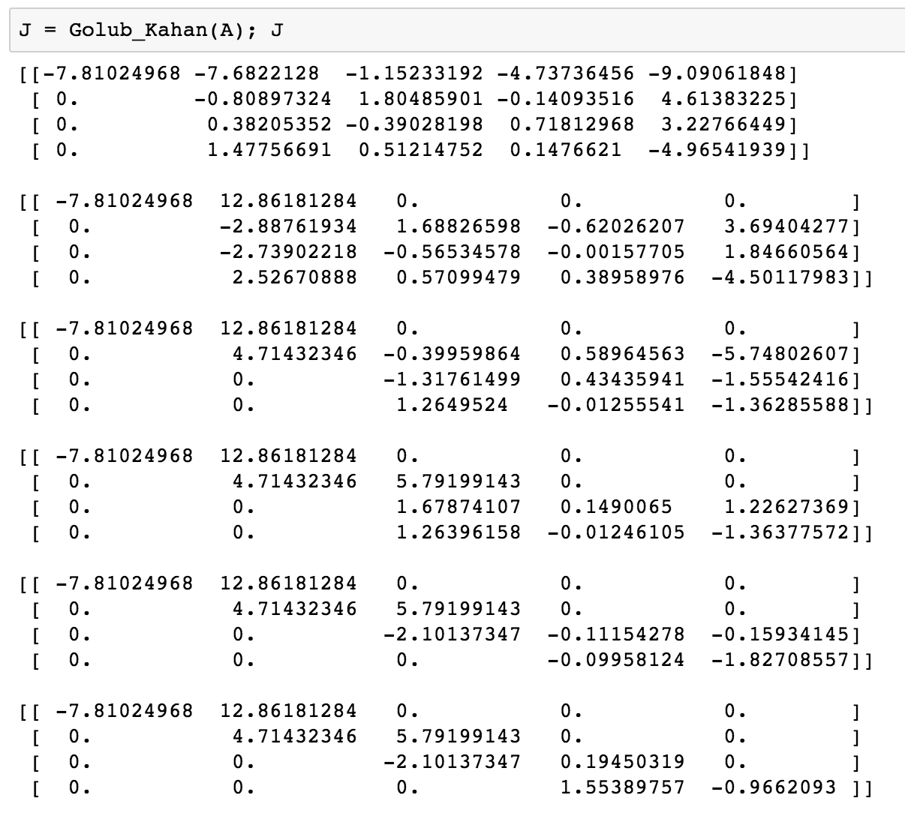

<h2> Bidiagonalization: Golub-Kahan Method with Householder Reflectors</h2>

This is a review of the Golub-Kahan Bidiagonalization Method, using Householder reflectors. The method was developed in 1965 by <a href="https://en.wikipedia.org/wiki/Gene_H._Golub">Gene H Golub</a> and <a href="https://en.wikipedia.org/wiki/William_Kahan">William M Kahan</a> to eliminate problems from ill-conditioned or rank-deficient matrices. This method used in numerous algorithms including LSQR and SVD. 

I include a digression on Householder reflectors...

 

as well as an example of the algorithm...

 

